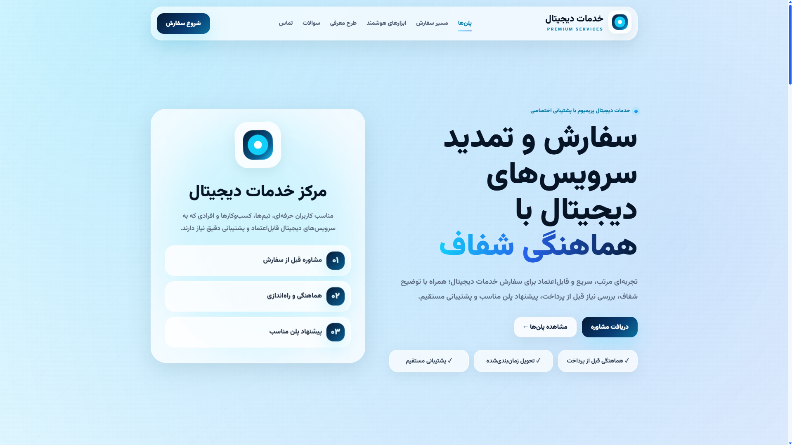

# Premium Digital Services Landing Page

<div align="center">

A modern, responsive, RTL, SEO-optimized landing page for premium digital services, subscription workflows, support requests, and service ordering.

Built with clean HTML, CSS, and Vanilla JavaScript. No framework. No build step. Ready for GitHub Pages.

<br />

[](#)
[](#)
[](#)
[](#)
[](#)
[](#)
[](LICENSE)

</div>

## Overview

**Premium Digital Services Landing Page** is a polished, production-ready static website template designed for digital service providers, subscription-based services, software access providers, AI-powered tools, support teams, and service-oriented businesses.

The project focuses on performance, accessibility, responsive design, SEO structure, and a clean RTL user experience. It is especially suitable for Persian/Farsi websites and can be easily customized for different brands, services, or business models.

## Live Demo

https://power0matin.github.io/digital-services-landing-page/

## Preview



## Features

- Fully responsive landing page
- RTL-first layout
- Persian/Farsi content structure
- SEO-friendly HTML markup
- Open Graph metadata
- Twitter Card metadata
- JSON-LD structured data
- FAQ schema support
- Clean semantic HTML5 structure
- Accessible navigation
- Skip-to-content link
- Smooth scroll behavior
- Scroll reveal animations
- Active section navigation
- Mobile sticky CTA
- Glassmorphism UI style
- Premium visual design
- No external framework required
- No build tool required
- GitHub Pages ready
- Easy to customize and deploy

## Tech Stack

| Technology         | Purpose                                             |
| ------------------ | --------------------------------------------------- |
| HTML5              | Semantic page structure                             |
| CSS3               | Layout, responsive design, animation, visual system |
| Vanilla JavaScript | Reveal animations and active navigation state       |
| JSON-LD            | Structured data for SEO                             |
| GitHub Pages       | Static hosting                                      |

## Project Structure

```txt
.
├── index.html
├── robots.txt
├── sitemap.xml
├── README.md
├── LICENSE
├── CHANGELOG.md
├── CONTRIBUTING.md
├── CODE_OF_CONDUCT.md
├── SECURITY.md
├── .nojekyll
├── .gitignore
├── assets/
│   ├── css/
│   │   └── styles.css
│   ├── js/
│   │   └── main.js
│   ├── fonts/
│   │   └── README.md
│   └── images/
│       ├── preview.png
│       └── og-cover.jpg
└── .github/
    ├── PULL_REQUEST_TEMPLATE.md
    └── ISSUE_TEMPLATE/
        ├── config.yml
        ├── bug_report.md
        └── feature_request.md
```

## Page Sections

| Section      | Description                               |
| ------------ | ----------------------------------------- |
| Hero         | Main value proposition and CTA            |
| Plans        | Service packages and pricing cards        |
| How It Works | Step-by-step ordering process             |
| Smart Tools  | Digital and AI-powered service highlights |
| Referral     | Referral and reward program section       |
| FAQ          | Frequently asked questions                |
| Support      | Trust and support highlights              |
| Contact      | Contact and request submission CTA        |
| Footer       | Final CTA and site identity               |

## SEO Features

This project includes a professional SEO foundation:

- Optimized page title
- Meta description
- Meta robots directives
- Canonical URL
- Open Graph tags
- Twitter Card tags
- Semantic heading hierarchy
- FAQ schema
- WebSite schema
- ProfessionalService schema
- Sitemap file
- Robots.txt file
- Mobile-friendly viewport
- Theme color
- Accessible navigation labels

## Structured Data

The project includes JSON-LD schema for:

- `WebSite`
- `ProfessionalService`
- `FAQPage`

These schemas help search engines better understand the website, services, and FAQ content.

## GitHub Topics

Recommended topics for this repository:

```txt
html
css
javascript
landing-page
rtl
persian
farsi
seo
seo-optimized
responsive-design
static-site
github-pages
web-design
frontend
ui
ux
glassmorphism
accessibility
schema-org
json-ld
open-graph
digital-services
premium-services
subscription-service
```

## Getting Started

Clone the repository:

```bash
git clone https://github.com/power0matin/digital-services-landing-page.git
```

Go to the project directory:

```bash
cd digital-services-landing-page
```

Run a local development server:

```bash
python -m http.server 3000
```

Open in your browser:

```txt
http://localhost:3000
```

## Deployment with GitHub Pages

1. Push the project to GitHub.
2. Open repository settings.
3. Go to **Pages**.
4. Under **Build and deployment**, choose:
   - Source: `Deploy from a branch`
   - Branch: `main`
   - Folder: `/root`
5. Save settings.

Your website should be available at:

```txt
https://power0matin.github.io/digital-services-landing-page/
```

## Customization Checklist

Before publishing, update:

- Website title
- Meta description
- Canonical URL
- Open Graph URL
- Open Graph image
- Twitter image
- Contact email
- Service prices
- FAQ answers
- Sitemap URL
- Robots sitemap URL
- README preview image
- README live demo URL

## Recommended Meta Values

Recommended homepage title:

```txt
خدمات دیجیتال پریمیوم | سفارش، تمدید و پشتیبانی حرفه‌ای
```

Recommended meta description:

```txt
سفارش و تمدید خدمات دیجیتال پریمیوم با مشاوره قبل از پرداخت، تحویل زمان‌بندی‌شده، پشتیبانی مستقیم و انتخاب پلن مناسب برای کاربران، تیم‌ها و کسب‌وکارها.
```

Recommended repository description:

```txt
A modern, SEO-optimized, RTL landing page for premium digital services, subscription workflows, support, and service ordering.
```

## Performance Guidelines

Recommended Lighthouse targets:

| Metric                   | Target         |
| ------------------------ | -------------- |
| Performance              | 90+            |
| Accessibility            | 90+            |
| Best Practices           | 90+            |
| SEO                      | 90+            |
| First Contentful Paint   | Less than 2s   |
| Largest Contentful Paint | Less than 2.5s |
| Cumulative Layout Shift  | Less than 0.1  |

## Accessibility

Accessibility considerations included in the project:

- Semantic HTML structure
- Skip-to-content link
- Accessible navigation label
- Focus-visible styles
- Clear CTA labels
- Responsive layout
- Keyboard-friendly links and buttons
- High contrast primary actions
- Reduced-motion support

## Browser Support

| Browser       | Support   |
| ------------- | --------- |
| Chrome        | Supported |
| Edge          | Supported |
| Firefox       | Supported |
| Safari        | Supported |
| Mobile Chrome | Supported |
| Mobile Safari | Supported |

## Roadmap

- [x] Static RTL landing page
- [x] Responsive layout
- [x] SEO metadata
- [x] FAQ schema
- [x] GitHub Pages compatibility
- [x] Professional README
- [ ] Contact form
- [ ] Multi-page structure
- [ ] Dark mode
- [ ] Service filtering
- [ ] Admin-editable content
- [ ] Automated Lighthouse checks
- [ ] GitHub Actions deployment workflow

## SEO Deployment Checklist

Before going live:

- [ ] Replace all placeholder URLs
- [ ] Add real domain or final GitHub Pages URL
- [ ] Update `robots.txt`
- [ ] Update `sitemap.xml`
- [ ] Add Open Graph image
- [ ] Add Twitter image
- [ ] Compress images
- [ ] Test mobile layout
- [ ] Validate HTML
- [ ] Validate JSON-LD schema
- [ ] Run Lighthouse audit
- [ ] Check heading hierarchy
- [ ] Check all internal links
- [ ] Check all CTA links
- [ ] Add privacy policy if collecting user data
- [ ] Add terms of service if selling services

## Security Notes

This is a static frontend project and does not process payments, authentication, or user data by default.

If you add a contact form, payment flow, or backend integration:

- Validate all inputs server-side
- Use HTTPS
- Do not expose API keys in frontend code
- Add rate limiting to form endpoints
- Add spam protection
- Add a privacy policy
- Store only necessary user data

## Contributing

Contributions are welcome.

Please read [CONTRIBUTING.md](CONTRIBUTING.md) before submitting changes.

## Code of Conduct

This project follows a community-friendly code of conduct.

Please read [CODE_OF_CONDUCT.md](CODE_OF_CONDUCT.md).

## Security Policy

If you discover a security issue, please read [SECURITY.md](SECURITY.md) and report it responsibly.

## Changelog

All notable changes are documented in [CHANGELOG.md](CHANGELOG.md).

## License

This project is licensed under the [MIT License](LICENSE).

## Author

Created and maintained by **Matin**.

GitHub:

https://github.com/power0matin

Repository:

https://github.com/power0matin/digital-services-landing-page

<div align="center">

Made for modern RTL digital service websites.

</div>
